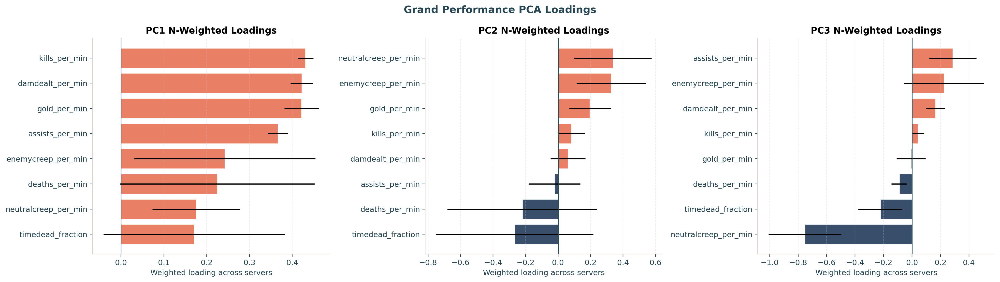
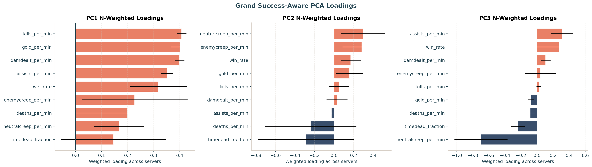
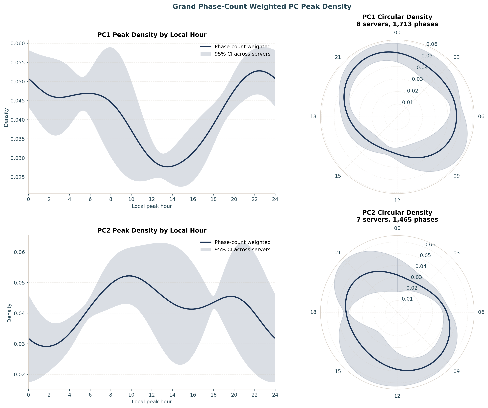
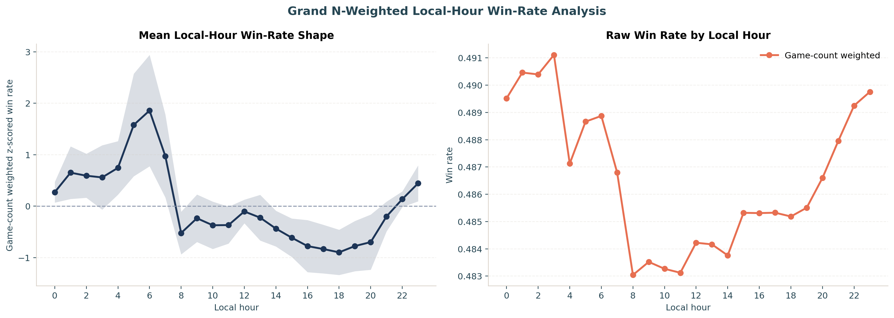

# Introduction

Almost every measured aspect of human physiology and behaviour oscillates with a
period of approximately 24 hours, driven by an endogenous circadian clock that is
entrained to the local light–dark cycle [@roenneberg2007epidemiology]. These
rhythms reach into cognition: attention, working memory, reaction time and
executive control all show reliable time-of-day modulation [@schmidt2007time].
Critically, the *phase* of these rhythms differs between people. The
morningness–eveningness dimension — colloquially "larks" versus "owls" — is a
stable, partly heritable trait [@horne1976self; @roenneberg2003life], and the
distribution of chronotypes in a population is broad and roughly continuous
[@adan2012circadian].

Chronotype matters for performance. When the timing of a demanding task is
misaligned with a person's internal clock — *social jet lag* — outcomes suffer.
Analysing 3.4 million learning-management-system logins, @smarr2018social showed
that the majority of students are chronically misaligned with their class
schedules and that greater misalignment predicts lower grades. In elite sport,
@facerchilds2015impact found that an athlete's peak performance time tracks their
circadian phenotype, with intra-day swings as large as ~26%. Within gaming
specifically, eveningness is over-represented and linked to disrupted sleep
[@hsu2024circadian], and competitive performance in esports is a structured,
trainable skill set rather than mere reflex [@nagorsky2020structure].

Online competitive gaming offers an unusually clean natural experiment for
chronobiology at scale. Millions of timestamped, standardised, skill-graded
matches are played around the clock, across the globe, by the same individuals
over months. If circadian structure shapes human behaviour, it should be legible
in this telemetry. *League of Legends* (LoL), a five-versus-five multiplayer game
operated on geographically separated regional servers, is well suited to the
question: each server has a known local time zone, allowing matches to be aligned
to *local* hour, and matchmaking continuously estimates each player's skill.

We test three questions:

1. **Existence.** Do individual players show ~24 h rhythms in their in-game
   behaviour?
2. **Bimodality (larks vs owls).** If rhythms exist, is the population of peak
   times *bimodal* — clustering into morning-peaking and evening-peaking groups —
   rather than a single mode?
3. **Consequence.** Does the *outcome* of play (skill change, ΔMMR) carry the
   same circadian signature as behaviour, or is success time-invariant?

We address these with a within-subject spectral analysis of ~8,000 high-ranked
players, replicated independently across 8 servers and combined by an N-weighted
meta-analysis.

# Methods

## Data provenance and aggregation

The analysis reuses the large longitudinal *League of Legends* cohort provided by
Riot Games and described by Aung et al. [@aung2018predicting] and Vardal et al.
[@vardal2022mind]. Its defining feature is the sampling design: a random sample of
players who registered **new accounts at the start of a competitive season** —
accounts with no prior ranked history — followed across **one entire season**
(21 January to November 2016) of default five-versus-five ranked Solo/Duo-queue
play. Because every account enters ranked play at the same default matchmaking
rating and is then observed continuously, the cohort offers an unusually clean
within-subject view of each player's full activity and skill trajectory — the
property our within-player periodogram and ΔMMR analyses depend on. Each match row
carries the per-minute performance fields we reduce by PCA together with the
player's pre-match rating, from which ΔMMR is derived. The same data lineage
underpins prior work on this cohort: early-season learning rate predicts
end-of-season skill [@aung2018predicting], and the temporal *spacing* of practice
(rather than its timing) shapes performance gains [@vardal2022mind].

Raw match records were supplied by Riot Games as a columnar Parquet store and
queried through an embedded DuckDB analytical database [@raasveldt2019duckdb],
from which an hourly aggregate table was materialised. We analysed the **eight
regional servers** used by the source-dataset papers [@aung2018predicting;
@vardal2022mind] — BR1, EUN1, EUW1, JP1, LA1, LA2, NA1 and OC1 — together
contributing ≈92.7 million ranked games; the remaining platforms (ID1, TR1 and
the PBE1 public-beta realm) were excluded as small or unreliable. For each server
we selected the `top_n_players = 1000` most active accounts and retained the first
`max_hour_limit = 5000` hours (~208 days) of each player's history to bound edge
effects. Each match timestamp was converted to the
server's **local hour** using a fixed per-server UTC offset, so that "9 a.m."
means the same wall-clock experience on every server.

## Behavioural features and principal components

Seven rate features were derived per game — gold, damage dealt, kills, deaths,
assists, neutral creeps and enemy creeps, each per minute — plus the fraction of
time spent dead. Population-level hourly features were standardised and reduced
by sign-oriented principal component analysis (SVD); per-game player records were
then projected onto this fixed basis so that every player is scored on a common
set of axes [@harris2020numpy]. The first two components dominate:

- **PC1** (≈62% of variance) loads *positively* on all activity features — a
  general **in-game output / engagement intensity** axis (high PC1 = a busy,
  high-tempo game).
- **PC2** (≈19% of variance) contrasts farming/economy (creeps, gold) against
  time spent dead — an **economy-versus-attrition** axis.

A complementary "success-aware" PCA that included win rate was computed for
descriptive comparison. As a direct skill-outcome metric we also computed
**ΔMMR**, the within-player change in matchmaking rating from one game to the
next.

## Within-subject periodograms

For each player and each metric (PC1, PC2, ΔMMR) we placed the game-level scores
on their irregular real-time stamps and computed a Lomb–Scargle periodogram
[@lomb1976least; @scargle1982studies] over periods of 6–48 h
(`player_n_freq = 2000` frequencies) using `astropy.timeseries.LombScargle`
[@astropy2018; @vanderplas2018understanding]. The Lomb–Scargle estimator is
appropriate here because match times are unevenly spaced. The (evenly spaced)
frequency grid is **anchored so that exactly 24 h is a grid node**, allowing a
true circadian peak to be reported at 24.0 h rather than snapping to a
neighbouring bin. Per-player periodograms were then **incoherently averaged**
within each server–metric cell (averaging *power*, which is phase-blind), and the
period of maximum mean power was recorded as that cell's best period. A population-level periodogram of raw activity
(`TIMEPLAYED`) and of win rate was computed analogously over 6–48 h.

## Phase estimation and multiple-testing control

To locate *when* in the day each player peaks, we fitted a fixed 24 h sinusoid by
ordinary least squares to each player's series, converted the fitted lag to a
**local peak hour** in $[0, 24)$, and tested the joint significance of the
sinusoid. Across the players in each server–metric cell, the resulting $p$-values
were corrected with the Benjamini–Hochberg false-discovery-rate procedure
[@benjamini1995controlling] at $\alpha = 0.05$. Only FDR-significant peak phases
entered the modality analysis.

## Circular modality: one versus two chronotypes

Peak hours are circular. For each server–metric cell with at least 20
FDR-significant phases we fitted two circular models to the phases (expressed as
angles) [@fisher1993statistical; @mardia2000directional; @berens2009circstat]:

- a **one-component von Mises** distribution (mean direction $\mu$ and
  concentration $\kappa$ estimated from the resultant length); and
- a **two-component von Mises mixture** fitted by expectation–maximisation.

Models were compared by the Bayesian Information Criterion [@schwarz1978estimating],
charging 2 free parameters to the one-component fit and 5 to the mixture; a
positive $\Delta\text{BIC} = \text{BIC}_1 - \text{BIC}_2$ favours two components,
i.e. two chronotype-like clusters. We report both a per-server tally and a final
**pooled** fit that aggregates significant phases across servers (using only cells
with ≥20 phases). As an assumption-light companion, we also summarised the same
phases with phase-count-weighted circular kernel density estimates ($\kappa = 4$).

## Across-server meta-analysis and quality control

All headline numbers are **N-weighted across servers**: period peaks are weighted
by the number of valid players, phase fractions by players analysed, and
population metrics by games played. Implementation used NumPy [@harris2020numpy],
SciPy [@virtanen2020scipy], pandas [@mckinney2010data] and Matplotlib
[@hunter2007matplotlib].

::: {.callout-note}
## Outlier handling
Two server-level period estimates — both from **JP1** — were robust outliers and
were excluded from the period meta-analysis: its ΔMMR peak (44.4 h, an implausible
near-double of the circadian period) and its PC1 peak (8.0 h, a flip onto the
third harmonic of the daily cycle). Outliers were flagged *within* each metric by
a median/MAD modified $z$-score (|z| > 3.5) combined with an absolute-deviation
gate (> 3 h from the median); the gate keeps genuine near-circadian values — peaks
one or two grid bins either side of 24 h — while still catching harmonics and
long-period artifacts, and it also decides the case where the 24 h-anchored grid
collapses the MAD to zero by placing most servers on the same bin. After exclusion
PC1 and ΔMMR rest on 7 servers / 7,000 players each; PC2 retains all 8.
:::

# Results

## Behaviour is rhythmic; success is not {#sec-periods}

Within-subject periodograms show a sharp circadian peak for behaviour and only
noise for outcome. For a single representative server (NA1), PC1 and PC2 each
produce a clean spike at ~24 h above a flat background, whereas ΔMMR yields a
broad, low, ragged spectrum with no dominant period (@fig-periodograms).

{#fig-periodograms width=100%}

This pattern is consistent across all servers. The N-weighted best period
(@fig-summary, left) is **23.96 h for PC1** (SEM 0.029) and **23.94 h for PC2**
(SEM 0.020), both indistinguishable from 24 h, with small between-server
scatter; the ΔMMR peak averages **exactly 24.00 h** (after removing the JP1
outlier) but rests on a far weaker peak (@tbl-periods).

| Metric | Servers | Players | Best period (h) | SEM (h) |
|:--|--:|--:|--:|--:|
| PC1 | 7 | 7,000 | 23.96 | 0.029 |
| PC2 | 8 | 8,000 | 23.94 | 0.020 |
| ΔMMR | 7 | 7,000 | 24.00 | 0.015 |

: N-weighted within-subject best periods. {#tbl-periods}

The fraction of *individually* FDR-significant players tells the same story
(@fig-summary, right): **21.4%** of players have a significant ~24 h rhythm in
PC1 and **18.5%** in PC2, but only **0.3%** do in ΔMMR (26 of 8,000 players).
Behaviour is strongly clock-locked; the *outcome* of competition is essentially
clock-agnostic.

{#fig-summary width=100%}

For reference, the population-level periodograms behave as expected: with the
24 h-anchored grid the raw activity periodogram (`TIMEPLAYED`) peaks at **exactly
24.0 h on every one of the eight servers**, and raw win rate peaks near 24 h on
average (N-weighted 23.6 h, though noisier across servers).

## What the components mean {#sec-pca}

The N-weighted PCA loadings (@fig-pca) confirm this reading: PC1 loads positively
on every activity feature — an overall output/engagement axis — while PC2
separates farming and economy from time spent dead. The success-aware
decomposition (lower panel) places only a modest positive win-rate loading on its
leading component (N-weighted 0.29), reinforcing that the dominant behavioural
axes are about *how* a game is played, not whether it is won.

::: {#fig-pca layout-ncol=1}
{#fig-pca-perf}

{#fig-pca-success}

N-weighted PCA loadings across servers; whiskers show between-server spread.
:::

## Two chronotypes: the peak-phase distribution is bimodal {#sec-bimodality}

The central question is the *shape* of the peak-time distribution. Pooling all
FDR-significant phases and comparing circular models, **both behavioural
components prefer a two-component von Mises mixture** (@fig-bimodality,
@tbl-bimodality):

- **PC1**: $\Delta\text{BIC} = 17.6$ in favour of two components, with peaks at
  **21.5 h** and **7.2 h** (weights 0.57 / 0.43) — an evening-peaking "owl"
  cluster and a morning-peaking "lark" cluster of nearly equal size.
- **PC2**: $\Delta\text{BIC} = 28.4$, with peaks at **9.4 h** and **19.9 h**
  (weights 0.65 / 0.35) — again a morning and an evening mode.

ΔMMR could not be tested for modality at all: no server reached the 20-significant-phase
threshold, so the pooled ΔMMR cell is empty.

| Metric | Servers | Phases | Preferred | ΔBIC (1−2) | Peak 1 (h) | Peak 2 (h) | Weights |
|:--|--:|--:|:--|--:|--:|--:|:--|
| PC1 | 8 | 1,715 | 2-component | 17.6 | 21.5 | 7.2 | 0.57 / 0.43 |
| PC2 | 7 | 1,465 | 2-component | 28.4 | 9.4 | 19.9 | 0.65 / 0.35 |
| ΔMMR | 0 | 0 | — | — | — | — | — |

: Pooled circular bimodality test on FDR-significant peak phases. {#tbl-bimodality}

{#fig-bimodality width=100%}

The per-server tally is consistent: across servers, FDR-significant PC1 phases
split 818 (one-component-preferred) to 897 (two-component-preferred) and PC2 704
to 761 — i.e. a majority of server-level phases independently favour the
two-cluster description, which is what produces a decisive *pooled* preference
once power is aggregated.

An assumption-light kernel-density view (@fig-density) reproduces the same
landscape: the phase-count-weighted circular density of PC1 peaks concentrates
around the late evening (weighted peak 22.4 h) while PC2 peaks in the morning
(9.8 h), each with a secondary lobe — the smooth-density counterpart of the
two-component fits.

{#fig-density width=100%}

## When do players actually win? {#sec-winrate}

Although individual skill *change* shows no rhythm, the aggregate win rate does
vary with local hour (@fig-winrate). Pooled across servers, win rate is highest in
the early-morning hours (~03:00–06:00 local) and lowest through the afternoon and
early evening. The absolute swing is small — raw win rate moves only between about
0.483 and 0.491 — and, because this is computed over *whichever* players are
online at each hour, it reflects a mixture of who plays when (composition) and any
genuine time-of-day effect, not a within-person performance curve. We therefore
treat it as descriptive context rather than a chronotype result.

{#fig-winrate width=100%}

# Discussion

Three findings stand out. First, **circadian rhythms are real and strong in LoL
play behaviour**: within-subject periodograms peak crisply at 24 h for both
behavioural principal components, the estimate is stable to three significant
figures across 8 independent servers, and more than one in five players carries an
individually significant daily rhythm. This is, to our knowledge, one of the
larger naturalistic demonstrations of behavioural circadian structure outside the
laboratory, and it complements educational [@smarr2018social] and athletic
[@facerchilds2015impact] big-data work.

Second, **the population of peak times is bimodal**. Both PC1 and PC2 prefer a
two-component von Mises mixture, recovering a morning cluster and an evening
cluster in each case. This is exactly the structure predicted if the player base
is a mixture of larks and owls [@horne1976self; @roenneberg2003life], and the
result survives a stringent pipeline (per-player FDR control, a BIC penalty
against the more complex model, and an outlier-screened meta-analysis) as well as
a non-parametric density cross-check. We are careful about the label: what we
measure is a *behavioural* phase — the hour at which a player's in-game output
peaks — not a physiological dim-light melatonin onset. Behavioural phase is
shaped by chronotype but also by school, work and social schedules. The bimodality
is genuine; equating each mode one-to-one with a biological chronotype is an
interpretation, not a measurement.

Third, **competitive success is essentially time-invariant**. ΔMMR shows no
within-subject circadian rhythm (0.3% FDR-significant; no server testable for
modality), even though the very same players, on the very same games, show clear
rhythms in *how* they play. The matchmaking system is designed to hold win rate
near 50% by pairing players of similar skill, which mechanically suppresses any
outcome rhythm; the small aggregate win-rate variation by hour (@sec-winrate) is
better explained by *who* is online than by a within-person performance curve.
The contrast with timescale is instructive: on this very cohort, *across*-season
skill change is highly structured and predictable — early-season learning rate
forecasts end-of-season rating [@aung2018predicting] — yet the *within*-day timing
of skill change leaves no detectable circadian mark. Indeed, prior analyses of
this same dataset deliberately set MMR aside as a match-to-match performance
measure, precisely because it is governed by the (opaque, win/loss-weighted)
matchmaking algorithm rather than by momentary individual play [@vardal2022mind];
our null is the chronobiological counterpart of that caution. The practical reading
for a competitive player is encouraging and slightly deflating at once: your
*style* swings with the clock, but the ladder largely launders away the
consequences.

## Limitations

This is an observational analysis of a self-selected, highly active, high-ranked
population (top ~1,000 per server), so the chronotype mixture we recover need not
match the general public. Phases are inferred from a fitted 24 h sinusoid on
irregular match times rather than from continuous physiological recording. Local
hour uses a single per-server UTC offset and does not model daylight-saving
transitions or the within-region spread of true time zones. The two-component von
Mises model is the simplest test for bimodality and does not exclude richer
multi-modal or continuous structure. Finally, the headline meta-analysis weights
servers by N; alternative weightings (e.g. equal-server) give qualitatively the
same conclusions but slightly different point estimates.

## Conclusion

Across 8 global servers and ~8,000 players, *League of Legends* behaviour is
clearly circadian and the distribution of personal peak times is bimodal — a
data-driven echo of larks and owls — while competitive outcome is not. The match
telemetry of a popular game turns out to be a surprisingly sharp instrument for
human chronobiology, and the analysis pipeline here (within-subject
Lomb–Scargle, FDR-controlled phase estimation, and BIC-compared circular mixtures,
meta-analysed across servers) is a reusable template for similar questions in
other large behavioural datasets.

# Declarations {.unnumbered}

## Availability of data and materials

The analysis code (`riot_analysis.py`, `grand_analysis.py`) and the de-identified
derived outputs that underlie every figure and statistic in this paper (the
per-server and grand summary tables under `results/`) are openly available at
[*repository URL — to add*]. The shared outputs carry no player account
identifiers or raw matchmaking ratings: the per-account selection lists are
withheld, and only de-identified aggregates are released. The raw match records are
proprietary to Riot Games and
restrictions apply to their availability: they were used for the current study under
the terms governing the longitudinal research cohort of Aung et al.
[@aung2018predicting] and Vardal et al. [@vardal2022mind], and so are not publicly
available. They are not redistributed here, and the pipeline rebuilds a local DuckDB
cache from the source Parquet store on demand.

## Competing interests

The author declares that they have no competing interests.

## Funding

No specific funding was received for this work.

## Authors' contributions

A.R.W. designed the study, performed the analysis, and wrote the manuscript. The
author read and approved the final manuscript.

## Acknowledgements

The author thanks Riot Games for the generous donation of the match data that made
this study possible.

# References {.unnumbered}

::: {#refs}
:::
